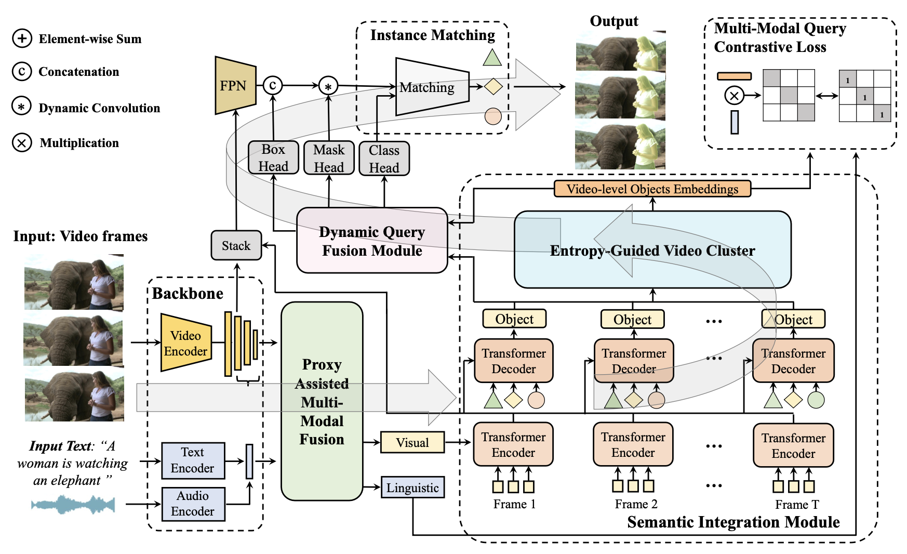

# Semantic-Assisted Object Clustering for Multi-Modal Referring Video Segmentation

Yong Liu, Zhuoyan Luo, Yicheng Xiao, Yitong Wang, Shuyan Li,
Xiu Li, Yujiu Yang, and Yansong Tang


## 📖 Abstract
This paper concentrates on Multi-modal Referring Video Segmentation task, where a well optimized model is able to recognize and segment the target objects referred by the given guidance signals, e.g., language description. Early approaches model this task as a sequence prediction problem. The lack of a global view of video content leads to difficulties in effectively utilizing inter-frame relationships. Some recent works propose to perform temporal modeling with vanilla attention mechanism. However, the condensed visual representation tends to be messy about target information due to occlusion or motion blur. Unlimited non-local operation would spread such noise to all the sequences and interfere with the extraction of global representations. To address the above issue, we present Semantic-assisted Object Cluster network (SOC) and the improved SOC++ in this paper. Our method unifies temporally selective interaction and cross-modal alignment to achieve video-level understanding. In SOC++, a proxy-assisted multi-modal fusion module is introduced to perform preliminary bidirectional activation. Then a semantic integration module with progressive frame-to-video structure facilitates joint space learning across modalities and time steps. Considering that potential noisy visual embeddings would impair the overall representation of target objects in unconstrained inter-frame interactions, we propose to perform tendentious video aggregation through emphasizing the indicative role of the informative frames with lower entropy in this part. A multi-modal query contrastive supervision is also utilized to help construct well-aligned joint space at the video level. Moreover, to integrate the advantage of high-level video information and the low-level details of each frame, we introduce a dynamic query fusion module that performs joint updating of these embeddings. We conduct extensive experiments on popular referring video segmentation benchmarks, and our method outperforms state-of-the-art competitors on all benchmarks by a remarkable margin. Besides, the emphasis on temporal coherence enhances the segmentation stability and adaptability of our method in processing text expressions with temporal variations.

## 📗 Framework



## 🛠️ Environment Setup
Please see the official code of our conference version for environment setup and data preparation: https://github.com/RobertLuo1/NeurIPS2023_SOC.
Note that for MeViS we process it into the same format as Ref-YouTubeVOS.

## Bakcbone Model
Please put the ckpt of pretrained backbone in the ``pretrained" folder.
```
pretrained
└── pretrained_swin_transformer
└── pretrained_roberta
```
- For pretrained_swin_transformer folder
download [Video-Swin-Base](https://github.com/SwinTransformer/storage/releases/download/v1.0.4/swin_base_patch244_window877_kinetics400_22k.pth)
- For pretrained_roberta folder
download config.json pytorch_model.bin tokenizer.json vocab.json from huggingface (roberta-base)

## Pretrained Checkpoints
The trained models for A2D-Sentences and MeViS are put [here](https://drive.google.com/drive/u/1/folders/1VTDOPd6WkDqQKaqvLbxu8JDhPhi6r9KX)


## 🚀 Training

- MeViS
  Run the "./scripts/train_mevis.sh.
  ```text
  bash ./scripts/train_mevis.sh
  ```

- A2D
  Run the scripts "./scripts/train_a2d.sh"
  ```text
  bash ./scripts/train_a2d.sh
  ```


- Ref-Youtube-VOS 
  Run the "./scripts/train_ytb.sh.
  ```text
  bash ./scripts/train_ytb.sh
  ```


## Evaluation

- A2D-Sentences

  Run the scripts ./scripts/eval_a2d.sh and remember to specify the checkpoint_path in the config file.


- Ref-Youtube-VOS

  Run the scripts ./scripts/infer_ref_ytb.sh and remember to specify the checkpoint_path in the config file.

- MeViS

  Run the scripts ./scripts/infer_mevis.sh and remember to specify the checkpoint_path in the config file.


## Acknowledgement
Code in this repository is built upon several public repositories. Thanks for the wonderful work [Referformer](https://github.com/wjn922/ReferFormer) and [MTTR](https://github.com/mttr2021/MTTR)


